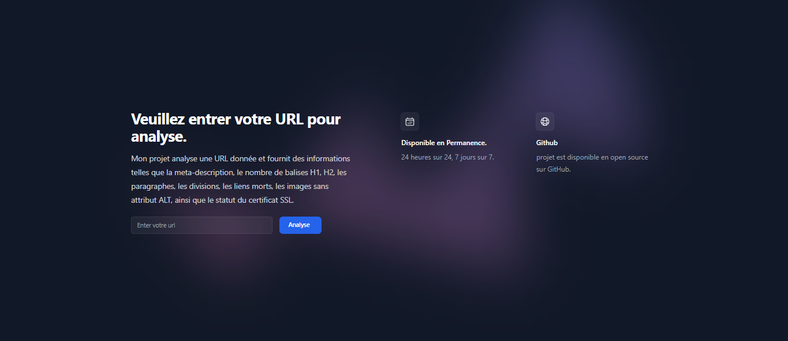
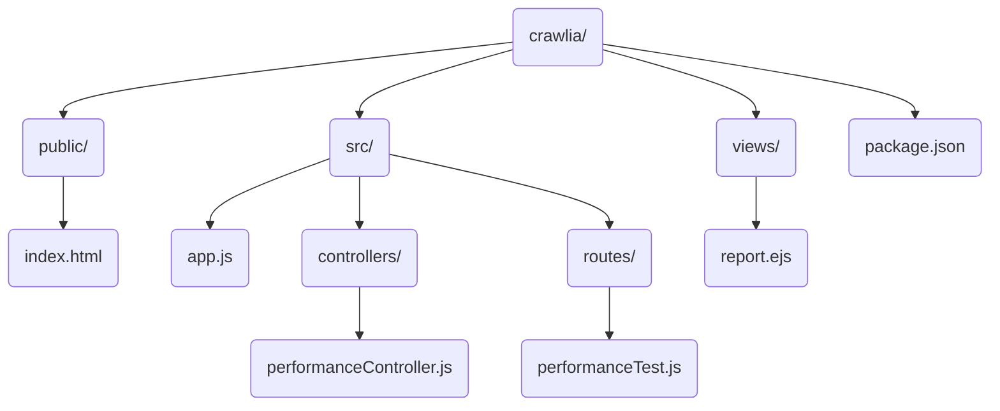

# Crawlia

**Crawlia** est une application web simple pour analyser la performance des pages web. Elle mesure le temps jusqu'au premier octet (TTFB), vérifie les attributs SEO, détecte les liens morts et vérifie la validité des certificats SSL. L'application affiche un loader pendant le traitement des données.



## Prérequis

- Node.js (version 14 ou supérieure)
- pnpm

## Installation

Clonez le dépôt dans votre répertoire local :

```bash
git clone https://github.com/AdlalKheraz/Crawlia.git
cd crawlia
```
## Installez les dépendances du projet :
```bash
pnpm install
```

## Utilisation
Démarrez le serveur :
```bash
node src/app.js
```
Ouvrez votre navigateur et accédez à l'URL suivante :

http://localhost:3000

Entrez l'URL de la page web que vous souhaitez analyser dans le formulaire et cliquez sur "Analyser". Un loader s'affichera pendant que l'application traite les données.

## Structure du Projet





## Fichiers Importants
- public/index.html : Contient le formulaire d'entrée de l'URL et le loader.
- src/app.js : Configure le serveur Express et les middlewares.
- src/controllers/performanceController.js : Contient la logique pour effectuer le test de performance et vérifier le certificat SSL.
- src/routes/performanceTest.js : Définit les routes pour les tests de performance.
- views/report.ejs : Affiche les résultats du test de performance.

## Fonctionnalités

- Mesure du TTFB : Mesure le temps jusqu'au premier octet.
- Vérification des attributs SEO : Analyse la méta-description, les balises H1, H2, div, p et les images sans attribut alt.
- Détection des liens morts : Vérifie les liens et détecte ceux qui mènent à des pages 404.
- Vérification SSL : Vérifie la validité du certificat SSL du site.
- Loader : Affiche un loader pendant le traitement des données.

## Bibliothèques Utilisées
- Express.js : Un framework web pour Node.js qui simplifie la création d'applications web.

- Cheerio : Une bibliothèque légère et rapide inspirée de jQuery conçue spécifiquement pour le serveur Node.js. Cheerio permet de parcourir et de manipuler le HTML des pages web côté serveur, facilitant ainsi l'extraction et la manipulation de données. Elle est souvent utilisée dans les applications Node.js pour analyser et extraire des données à partir de documents HTML de manière similaire à jQuery dans les navigateurs web.

- Axios : Une bibliothèque HTTP client pour Node.js, qui simplifie les requêtes HTTP vers des services externes. Utilisée pour vérifier les liens et pour d'autres requêtes HTTP nécessaires dans l'application.

- EJS : Moteur de modèle JavaScript simple et efficace qui permet de générer des pages HTML côté serveur avec Node.js. Utilisé pour générer dynamiquement les pages HTML avec les résultats du test de performance.